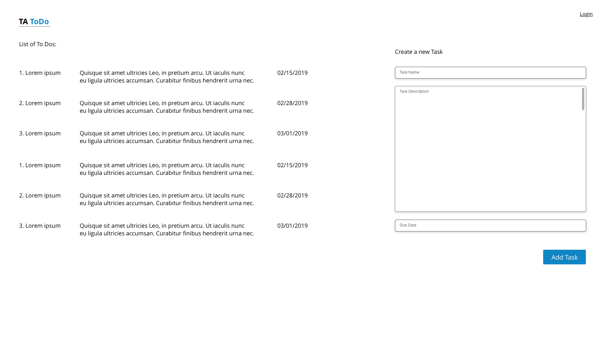

# Offline Note Taking App
## Requirement
* Create a page as per the mockup below: 
  

## General Rules
* Create development workflow automation using Webpack
* Serve the files on localhost
* Write semantic and logical HTML and validate it while build (automatically)

### Functionalities
#### UI
* Left side contains the list of already added tasks
* Right side of page has a form to add a task at a time.
* After clicking on `Add Task` button, application should save this task and it should also reflect the same into the task list (left part of the page), and should clear the form after adding a task succesfully.
* After a successful submission of the task, it should notify user with a message saying "A task is added successfully"

**NOTE: We are not focusing on the beautification of the UI at the moment. Let's focus on the functionality part rather**

#### Data Persistance
* We have to store all the tasks in indexDB, so as soon as user does an `Add Task` action, it should add this record into the indexDB (ignore the form validation for now).
* Apart from the form fields, it should also store `Task ID`, and `Creation Date` in the record.
* While user is still typing the dtails in the form, the application should automatically keep saving the draft in localStorage at every 5 seconds interval.
* If user closes the browser/tab while (s)he was creating a task, and open the application again later - the draft of last typed Task should automatically be populated in the fields.
## Offline Features
Create an offline application, which should enable offline caching for the following resources:  

* HTML files used by the application
* CSS files (if used)
* JS files
* Images
* Fonts

* The home page should have a navigation including a menu item called "Login", if user clicks on the login, it is supposed to take the user to '/login' page.  
* However, login requires an active Internet connection to work, so we need to have a fallback page (e.g. no-network.html), which shows simply a message that the "Browser is currently offline, try again later", if user tries to navigate to the login page.
* In `online` and `offline` events - the browser should show user a message saying "Conneted to the Internet" and "Internet Disconnected" respectively.

## Geolocation Feature
* Simulate a different city or location through Chrome Developer Tool and based on the city, your page should show the content in other language (basically redirect the page to a different html file - e.g. index-te.html for Telugu).

## The Node/Webpack Setup
* Create a new Node.JS project using `npm init`
* Install and list dependencies/dev-dependencies modules in the package.json
* Configure `webpack` and `webpack-dev-server` to serve your content on [localhost:4444](http://localhost:4444).

Webpack build should generate the build into `dest` folder and should generate aggregated and minified version of CSS (if any) and JS files. The content should finally be served on [localhost:4444](http://localhost:4444) from `dist` folder.

***Make Sure you add approriate files/folders in to `.gitignore` so it is not tracked by GIT***

### Folder Structure:

```bash
|-- .git
|-- .gitignore
|-- package.json
|-- webpack.config.js
|-- src
|   |-- css
|   |   |-- html5.css
|   |-- fonts
|   |-- js
|   |   |-- log.js (simple log function)
|   |   |-- offline.js (script to handle online/offline events)
|   |   |-- html5App.js
|   |-- img
|   |   |-- xyz.png
|   |   |-- abc.jpg
|   |   |-- favicon.ico
|   |-- offlineApp.manifest
|   |-- index.html
|   |-- no-network.html
|-- dist
|   |-- css
|   |   |-- app.css
|   |-- fonts
|   |-- js
|   |   |-- app.js
|   |-- img
|   |   |-- xyz.png
|   |   |-- abc.jpg
|   |   |-- favicon.ico
|   |-- offlineApp.manifest
|   |-- index.html
|   |-- no-network.html
```